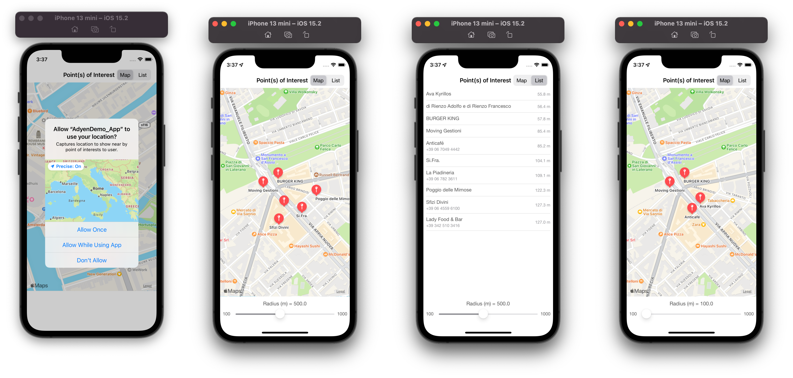

# Adyen Demo iOS App

## Objective

Make use of the TomTom API to build an app that shows a list of venues around the user’s location. Optionally, give the user a possibility to adjust the radius of interest. Decide yourself which venue details should be relevant to the user.

### Implementation
- Implemented TomTom Api POI Search web service to get points of interests based on user current location
- Choosen the query POI as "Restaurant"
- Displayed the POIs in list and map view, user has an option to toggle between the two
- Provided user with the UISlider to adjust the radius
- Written API response Test cases and validation cases for API Request.

## Screenshots

